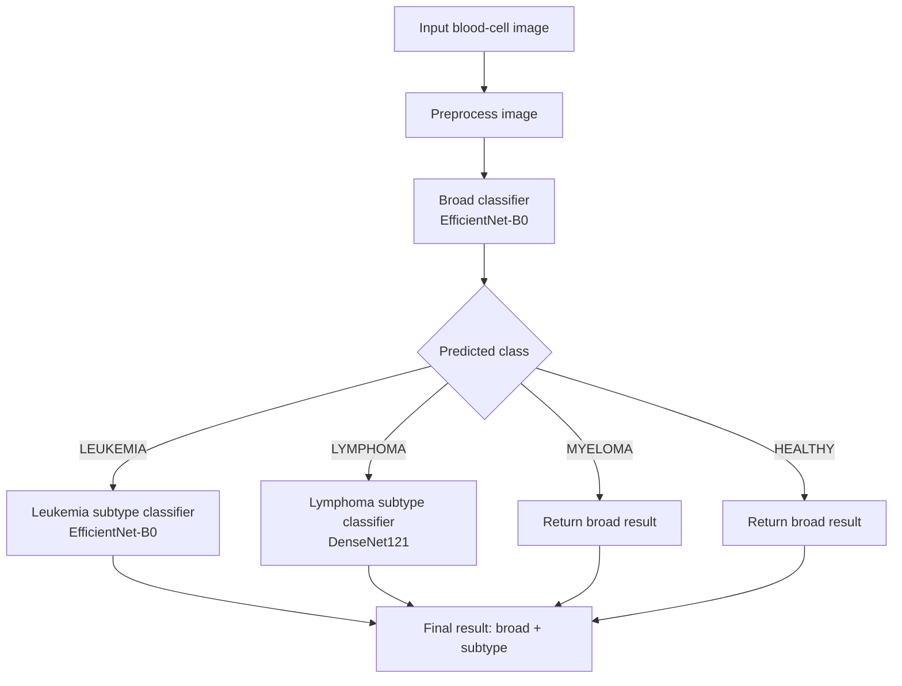

# Hierarchical Blood Cancer Detection from Microscopic Cell Images


This repository packages a notebook-driven deep learning project into a reusable inference pipeline for **blood cancer image classification**. It combines a **broad 4-class classifier** with **specialized subtype classifiers** to produce hierarchical predictions from microscopic cell images.

At a high level, the system:

- predicts whether an image is **Leukemia**, **Lymphoma**, **Myeloma**, or **Healthy**
- routes leukemia cases to a **4-class leukemia subtype model**
- routes lymphoma cases to a **3-class lymphoma subtype model**
- exposes the pipeline through a small Python CLI application

## Overview

The project is built around three trained PyTorch models recovered from the notebooks in [`notebooks/`](./notebooks):

1. **Tetra disease classifier**
   Predicts one of four broad classes:
   `LEUKEMIA`, `LYMPHOMA`, `MYELOMA`, `HEALTHY`
2. **Leukemia subtype classifier**
   Predicts one of:
   `ALL`, `AML`, `CLL`, `CML`
3. **Lymphoma subtype classifier**
   Predicts one of:
   `CLL`, `FL`, `MCL`

The notebooks contain the training and evaluation logic, while the source code in [`src/`](./src) turns those experiments into a reproducible local inference workflow.

## Features

- Hierarchical inference: broad diagnosis first, subtype only when relevant
- Project-local model loading from [`models/`](./models)
- Support for `.jpg`, `.jpeg`, `.png`, `.bmp`, and other Pillow-readable image formats
- CPU and CUDA inference modes
- JSON-friendly output for downstream apps or demos
- Clear separation between training notebooks and deployable inference code
- Model-specific preprocessing reproduced from notebook training flows

## Tech Stack

### Core stack

- Python
- PyTorch
- Torchvision
- NumPy
- Pillow

### Training and evaluation stack used in notebooks

- scikit-learn for classification reports and confusion matrices
- Matplotlib and Seaborn for visualization
- tqdm for progress tracking
- Kaggle notebook environment for training experiments

## ML / DL Concepts Used

- Transfer learning with ImageNet-pretrained backbones
- Hierarchical classification
- Fine-tuning of selected backbone layers
- Data augmentation for robust microscopy image classification
- Class reweighting for imbalanced classification
- Label smoothing
- Focal loss
- Learning-rate scheduling
- Early stopping
- Patient-wise splitting for lymphoma images

This repository does **not** currently use GenAI; it is a computer vision classification project.

## Architecture



## Workflow

### Training flow in notebooks

1. Prepare class-specific microscopy datasets.
2. Apply image augmentations and normalization.
3. Initialize a pretrained backbone.
4. Replace the classifier head for the target label space.
5. Train with task-specific loss and scheduler settings.
6. Save the best checkpoint.
7. Evaluate using accuracy, classification report, and confusion matrix.

### Inference flow in source code

1. [`app.py`](./app.py) parses the input image path and device.
2. [`src/load_models.py`](./src/load_models.py) rebuilds each model architecture and loads `.pth` weights.
3. [`src/preprocess.py`](./src/preprocess.py) loads the image and applies the correct preprocessing pipeline.
4. [`src/predict.py`](./src/predict.py) runs the tetra classifier first, then conditionally runs the appropriate subtype model.

## Dataset

The notebooks suggest the project combines multiple public microscopy datasets, referenced through Kaggle paths:

- **Leukemia dataset**
  Used for `ALL`, `AML`, `CLL`, `CML`, and `HEALTHY`
- **Malignant lymphoma classification dataset**
  Used for `CLL`, `FL`, and `MCL`
- **SegPC / myeloma-style cell images**
  Used for the `MYELOMA` branch in the broad classifier

### Dataset composition inferred from notebooks

#### Broad 4-class classifier

The broad classifier notebook merges several sources into a single task:

- Leukemia images are grouped into one superclass: `LEUKEMIA`
- Lymphoma images are grouped into one superclass: `LYMPHOMA`
- Myeloma images become `MYELOMA`
- Healthy blood smear images become `HEALTHY`

Key notebook details:

- Leukemia training pool: `12000` images
- Lymphoma pool: `374` images
- Myeloma pool: `498` images
- Healthy pool: `3000` images
- Lymphoma split is **patient-wise**
- Lymphoma data is oversampled `x4`
- Myeloma data is oversampled `x2`

#### Leukemia subtype classifier

- 4 classes: `ALL`, `AML`, `CLL`, `CML`
- Training set size printed in notebook: `12000`
- Test evaluation size: `4000` images total, `1000` per subtype
- Healthy classes are explicitly removed before training

#### Lymphoma subtype classifier

- 3 classes: `CLL`, `FL`, `MCL`
- Dataset split: `80/20` train/validation
- Validation report shown on `75` images

## Notebook Breakdown

### [`notebooks/blood_cancer.ipynb`](./notebooks/blood_cancer.ipynb)

Purpose:
- trains the **broad 4-class blood cancer classifier**

Backbone:
- `EfficientNet-B0`

Task:
- `LEUKEMIA` vs `LYMPHOMA` vs `MYELOMA` vs `HEALTHY`

Notable training choices:
- image size: `224 x 224`
- batch size: `32`
- epochs: `10`
- optimizer: `Adam(lr=1e-4)`
- scheduler: `StepLR(step_size=3, gamma=0.5)`
- weighted cross-entropy with label smoothing `0.1`
- gradient clipping
- early stopping
- backbone initially frozen, then unfrozen after epoch 4

Augmentations:
- resize
- horizontal flip
- rotation `40`
- color jitter
- random resized crop
- Gaussian blur
- random grayscale
- ImageNet normalization

### [`notebooks/lukemia_sub.ipynb`](./notebooks/lukemia_sub.ipynb)

Purpose:
- trains the **leukemia subtype classifier**

Backbone:
- `EfficientNet-B0`

Task:
- `ALL`, `AML`, `CLL`, `CML`

Notable training choices:
- image size: `224 x 224`
- batch size: `32`
- training loop configured for `25` epochs in the function
- optimizer: `Adam`
  - backbone LR: `3e-5`
  - classifier LR: `3e-4`
- weight decay: `1e-4`
- scheduler: `ReduceLROnPlateau`
- label smoothing `0.05`
- mixed precision training with `torch.amp`
- balanced validation subset with `200` samples per class
- custom dataset cleanup to remove healthy-class folders

Augmentations:
- resize
- horizontal flip
- small rotation
- random affine translation
- color jitter
- ImageNet normalization

### [`notebooks/lymphoma_sub.ipynb`](./notebooks/lymphoma_sub.ipynb)

Purpose:
- trains the **lymphoma subtype classifier**

Backbone:
- `DenseNet121`

Task:
- `CLL`, `FL`, `MCL`

Notable training choices:
- image size: `224 x 224`
- batch size: `32`
- epochs: `20`
- optimizer: `AdamW`
  - early features LR: `1e-5`
  - deeper features LR: `1e-4`
  - classifier LR: `1e-3`
- scheduler: `ReduceLROnPlateau(mode='max', patience=3)`
- focal loss
- 80/20 dataset split

Augmentations:
- resize
- horizontal flip
- vertical flip
- rotation `20`
- color jitter
- random resized crop

## Source Code

- [`app.py`](./app.py)
  CLI entrypoint for image classification
- [`src/load_models.py`](./src/load_models.py)
  Recreates model architectures and loads `.pth` checkpoints
- [`src/preprocess.py`](./src/preprocess.py)
  Image loading and transform building
- [`src/predict.py`](./src/predict.py)
  Routed prediction logic and probability formatting

## Results

The following metrics were extracted from notebook outputs.

| Model | Task | Backbone | Reported Metric |
|---|---|---|---|
| Broad classifier | `LEUKEMIA / LYMPHOMA / MYELOMA / HEALTHY` | EfficientNet-B0 | **99.79% test accuracy** on 5,352 images |
| Leukemia subtype | `ALL / AML / CLL / CML` | EfficientNet-B0 | **87.62% test accuracy** on 4,000 images |
| Lymphoma subtype | `CLL / FL / MCL` | DenseNet121 | **84.00% validation accuracy** on 75 images |

### Broad classifier highlights

- overall accuracy: `0.9979`
- lymphoma recall: `0.9467`
- myeloma precision/recall: `1.0000 / 1.0000`

### Leukemia subtype highlights

- best performing class in notebook output: `CML` with recall `1.00`
- hardest class in notebook output: `ALL` with recall `0.65`

### Lymphoma subtype highlights

- `CLL`: precision `0.87`, recall `0.80`
- `FL`: precision `0.90`, recall `0.90`
- `MCL`: precision `0.74`, recall `0.81`

## Project Structure

```text
Main_model/
├── app.py
├── README.md
├── requirements.txt
├── models/
│   ├── blood_cancer.pth
│   ├── lukemia_sub.pth
│   ├── lymphoma_sub.pth
│   └── README.md
├── notebooks/
│   ├── blood_cancer.ipynb
│   ├── lukemia_sub.ipynb
│   ├── lymphoma_sub.ipynb
│   └── README.md
├── src/
│   ├── __init__.py
│   ├── load_models.py
│   ├── predict.py
│   └── preprocess.py
└── test_samples/
    ├── 1703.bmp
    ├── ALL.jpg
    ├── healty_test.jpg
    └── MCL.png
```

## Installation

### 1. Clone the repository

```powershell
git clone https://github.com/TheegalaYeseswini/Blood-cancer-detection.git
cd Blood-cancer-detection
```

### 2. Create and activate a virtual environment

```powershell
python -m venv venv
.\venv\Scripts\Activate.ps1
```

### 3. Install dependencies

```powershell
python -m pip install --upgrade pip
python -m pip install -r requirements.txt
```

## Usage

### Run standard prediction

```powershell
python app.py --image ".\\test_samples\\ALL.jpg"
```

### Get structured JSON output

```powershell
python app.py --image ".\\test_samples\\ALL.jpg" --json
```

### Select the device automatically

```powershell
python app.py --image ".\\test_samples\\MCL.png" --device auto --json
```

### Expected behavior

- If the broad classifier predicts `LEUKEMIA`, the app runs the leukemia subtype model.
- If the broad classifier predicts `LYMPHOMA`, the app runs the lymphoma subtype model.
- If the broad classifier predicts `MYELOMA` or `HEALTHY`, no subtype model is used.

## Example Output

```json
{
  "tetraclassifier": {
    "predicted_label": "LEUKEMIA"
  },
  "selected_subtype_model": {
    "predicted_label": "ALL"
  },
  "combined": {
    "primary_label": "LEUKEMIA",
    "secondary_label": "ALL"
  }
}
```

## Limitations

- Training logic lives in notebooks rather than a fully modular training package.
- Dataset download and preparation are not yet automated in this repository.
- Lymphoma results are reported on a validation split, not a separate published test set.
- No experiment tracking, model cards, or calibration analysis is included yet.
- No web app or API deployment layer is included yet.

## Future Improvements

- Refactor notebook training code into reusable Python modules
- Add dataset preparation scripts and documented data provenance
- Export confusion matrices and training curves as versioned assets
- Add a Streamlit or FastAPI front end for demo use
- Add unit tests for model loading and preprocessing
- Add model calibration and uncertainty reporting
- Benchmark CPU vs GPU inference latency

## Contributing

Contributions are welcome, especially around:

- code cleanup and training refactors
- reproducible dataset pipelines
- UI or API deployment
- evaluation on external clinical-style test sets

Suggested workflow:

1. Fork the repository
2. Create a feature branch
3. Make focused changes
4. Open a pull request with a clear summary

## License

This repository does **not currently include a license file**. If you want others to reuse or contribute to the code confidently, add a `LICENSE` file such as `MIT` or `Apache-2.0`.
