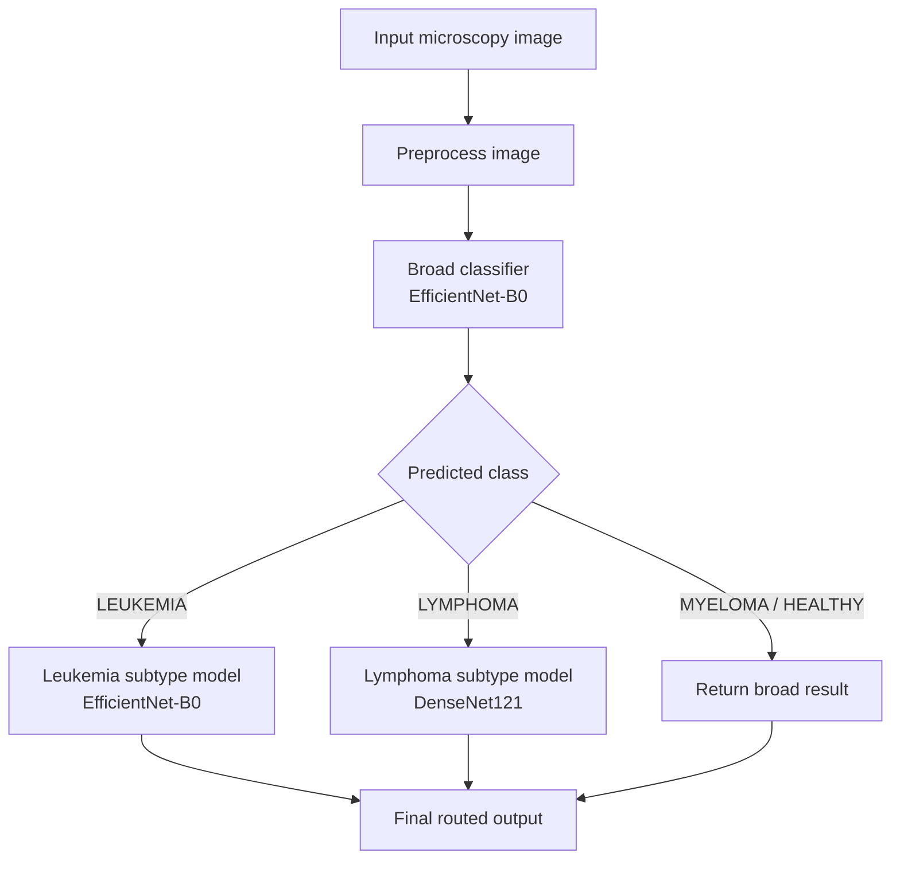

# Blood Cancer AI


A hierarchical deep-learning project for **blood cancer detection from microscopic blood-cell images**. This repository combines notebook-trained PyTorch models with a multi-page Streamlit application for interactive inference, model inspection, and portfolio-ready demos.

## Overview

The system predicts blood-cancer classes in **two stages**:

1. A **broad disease classifier** predicts one of:
   - `LEUKEMIA`
   - `LYMPHOMA`
   - `MYELOMA`
   - `HEALTHY`
2. A **specialized subtype model** is only used when the broad classifier predicts:
   - `LEUKEMIA` -> subtype model predicts `ALL`, `AML`, `CLL`, `CML`
   - `LYMPHOMA` -> subtype model predicts `CLL`, `FL`, `MCL`

This hierarchical design keeps the pipeline easier to interpret, easier to demo, and closer to how the medical problem is structured.

## What This Repository Contains

- trained model checkpoints in [`models/`](./models)
- original training notebooks in [`notebooks/`](./notebooks)
- reusable inference code in [`src/`](./src)
- a production-style Streamlit UI for uploads, charts, sample inputs, and downloadable reports
- sample microscopy images in [`test_samples/`](./test_samples)

## Model Pipeline



## Models Used

| Model | Checkpoint | Backbone | Output Labels | Role |
|---|---|---|---|---|
| Broad disease classifier | `models/blood_cancer.pth` | EfficientNet-B0 | `LEUKEMIA`, `LYMPHOMA`, `MYELOMA`, `HEALTHY` | Always runs first |
| Leukemia subtype classifier | `models/lukemia_sub.pth` | EfficientNet-B0 | `ALL`, `AML`, `CLL`, `CML` | Runs only after a leukemia broad prediction |
| Lymphoma subtype classifier | `models/lymphoma_sub.pth` | DenseNet121 | `CLL`, `FL`, `MCL` | Runs only after a lymphoma broad prediction |

### Inference preprocessing

- All inference images are loaded with Pillow and converted to `RGB`
- Images are resized to `224 x 224`
- The broad classifier and leukemia subtype classifier use ImageNet normalization:
  - mean: `(0.485, 0.456, 0.406)`
  - std: `(0.229, 0.224, 0.225)`
- The lymphoma subtype model uses resize + tensor conversion at inference

## Dataset Information

The notebooks indicate that this project was built from **multiple microscopy image datasets** hosted through Kaggle notebook paths.

### 1. Leukemia dataset

Used in:
- `notebooks/lukemia_sub.ipynb`
- `notebooks/blood_cancer.ipynb`

Notebook paths:
- training root: `/kaggle/input/datasets/priyaadharshinivs062/leukemia-dataset/train/train`
- test root: `/kaggle/input/datasets/priyaadharshinivs062/leukemia-dataset/test/test`

Classes used:
- `ALL`
- `AML`
- `CLL`
- `CML`
- healthy images also appear in the broader dataset construction

Notes:
- The leukemia subtype notebook explicitly removes healthy folders before subtype training
- The notebook output shows `12000` training images across the leukemia subtype classes
- The test evaluation shown in the notebook uses `4000` images total, with `1000` samples per subtype

### 2. Malignant lymphoma classification dataset

Used in:
- `notebooks/lymphoma_sub.ipynb`
- `notebooks/blood_cancer.ipynb`

Notebook path:
- `/kaggle/input/datasets/andrewmvd/malignant-lymphoma-classification`

Classes used:
- `CLL`
- `FL`
- `MCL`

Notes:
- The lymphoma subtype notebook uses an `80/20` train-validation split
- The broad-class notebook also uses lymphoma images as the `LYMPHOMA` superclass
- The broad-class notebook performs a **patient-wise split** for lymphoma data

### 3. Myeloma / SegPC-style microscopy data

Used in:
- `notebooks/blood_cancer.ipynb`

Notebook paths:
- training: `//kaggle/input/datasets/sbilab/segpc2021dataset/TCIA_SegPC_dataset/TCIA_SegPC_dataset/TCIA_SegPC_dataset/train/train/train/x`
- validation: `/kaggle/input/datasets/sbilab/segpc2021dataset/TCIA_SegPC_dataset/TCIA_SegPC_dataset/TCIA_SegPC_dataset/validation/validation/x`

Role:
- contributes the `MYELOMA` class for the broad disease classifier

### 4. Broad-class dataset composition inferred from the notebook

The broad classifier merges multiple datasets into a single 4-class problem:

- `LEUKEMIA` -> grouped from leukemia subtype images
- `LYMPHOMA` -> grouped from lymphoma subtype images
- `MYELOMA` -> grouped from myeloma microscopy images
- `HEALTHY` -> grouped from healthy blood-smear images

Counts printed in the notebook:

| Group | Approx. image count in notebook output |
|---|---:|
| Leukemia pool | 12000 |
| Lymphoma pool | 374 |
| Myeloma pool | 498 |
| Healthy pool | 3000 |

Additional broad-class notebook handling:
- lymphoma images were oversampled `x4`
- myeloma images were oversampled `x2`
- external test folders were used for leukemia subtype-specific evaluation

## Training Notebook Summary

### `notebooks/blood_cancer.ipynb`

Purpose:
- trains the **broad 4-class blood cancer classifier**

Architecture:
- `EfficientNet-B0`

Key settings recovered from notebook cells:
- epochs: `10`
- batch size: `32`
- optimizer: `Adam(lr=1e-4)`
- scheduler: `StepLR(step_size=3, gamma=0.5)`
- loss: weighted cross-entropy with label smoothing `0.1`
- backbone initially frozen, later unfrozen
- early stopping used

Training augmentations:
- resize to `224 x 224`
- horizontal flip
- rotation `40`
- color jitter
- random resized crop
- Gaussian blur
- random grayscale
- ImageNet normalization

### `notebooks/lukemia_sub.ipynb`

Purpose:
- trains the **leukemia subtype classifier**

Architecture:
- `EfficientNet-B0`

Key settings:
- batch size: `32`
- training loop configured for `25` epochs
- optimizer: `Adam`
  - backbone LR: `3e-5`
  - classifier LR: `3e-4`
- weight decay: `1e-4`
- scheduler: `ReduceLROnPlateau`
- label smoothing: `0.05`
- mixed precision training with `torch.amp`

Training augmentations:
- resize to `224 x 224`
- horizontal flip
- small rotation
- random affine translation
- color jitter
- ImageNet normalization

### `notebooks/lymphoma_sub.ipynb`

Purpose:
- trains the **lymphoma subtype classifier**

Architecture:
- `DenseNet121`

Key settings:
- epochs: `20`
- batch size: `32`
- optimizer: `AdamW`
  - early layers LR: `1e-5`
  - deeper layers LR: `1e-4`
  - classifier LR: `1e-3`
- scheduler: `ReduceLROnPlateau(mode='max', patience=3)`
- loss: `FocalLoss`

Training augmentations:
- resize to `224 x 224`
- horizontal flip
- vertical flip
- rotation `20`
- color jitter
- random resized crop

## Results Snapshot

The following values are taken from notebook outputs.

| Model | Metric |
|---|---|
| Broad classifier | **99.79%** test accuracy |
| Leukemia subtype classifier | **87.62%** test accuracy |
| Lymphoma subtype classifier | **84.00%** validation accuracy |

### Broad classifier highlights

- overall accuracy: `0.9979`
- lymphoma recall: `0.9467`
- myeloma precision/recall: `1.0000 / 1.0000`

### Leukemia subtype highlights

- `ALL`: precision `0.91`, recall `0.65`, F1 `0.76`
- `AML`: precision `0.79`, recall `0.93`, F1 `0.85`
- `CLL`: precision `0.88`, recall `0.92`, F1 `0.90`
- `CML`: precision `0.95`, recall `1.00`, F1 `0.97`

### Lymphoma subtype highlights

- `CLL`: precision `0.87`, recall `0.80`, F1 `0.83`
- `FL`: precision `0.90`, recall `0.90`, F1 `0.90`
- `MCL`: precision `0.74`, recall `0.81`, F1 `0.77`

## Streamlit App

The repository includes a multi-page Streamlit interface designed for demos, recruiters, and deployment.

### Pages

- `app.py`
  - landing dashboard
  - project overview
  - benchmark summary
  - dataset composition preview
- `pages/1_Inference_Studio.py`
  - sample gallery
  - file upload
  - camera input
  - routed inference
  - JSON / CSV / PDF exports
- `pages/2_Model_Insights.py`
  - benchmark charts
  - class-wise metrics
  - model catalog
  - notebook-derived summaries
- `pages/3_Workflow_and_Data.py`
  - routing workflow
  - data overview
  - repository map
- `pages/4_About.py`
  - deployment notes
  - portfolio positioning
  - limitations and roadmap

## Repository Structure

```text
project/
|-- app.py
|-- pages/
|   |-- 1_Inference_Studio.py
|   |-- 2_Model_Insights.py
|   |-- 3_Workflow_and_Data.py
|   `-- 4_About.py
|-- components/
|   |-- cards.py
|   |-- charts.py
|   `-- theme.py
|-- utils/
|   |-- exports.py
|   |-- inference.py
|   |-- project_content.py
|   `-- state.py
|-- assets/
|   `-- theme.css
|-- src/
|   |-- cli.py
|   |-- load_models.py
|   |-- predict.py
|   `-- preprocess.py
|-- models/
|-- notebooks/
|-- test_samples/
|-- requirements.txt
|-- Dockerfile
`-- README.md
```

## Installation

### 1. Clone the repository

```powershell
git clone https://github.com/TheegalaYeseswini/Blood-cancer-detection.git
cd Blood-cancer-detection
```

### 2. Create and activate a virtual environment

```powershell
python -m venv venv
.\venv\Scripts\Activate.ps1
```

### 3. Install dependencies

```powershell
python -m pip install --upgrade pip
python -m pip install -r requirements.txt
```

## Running the Project

### Run the Streamlit app

```powershell
streamlit run app.py
```

If `streamlit` is not recognized:

```powershell
.\venv\Scripts\streamlit.exe run app.py
```

Default local URL:

```text
http://localhost:8501
```

### Run CLI inference

```powershell
python -m src.cli --image ".\test_samples\ALL.jpg"
python -m src.cli --image ".\test_samples\MCL.png" --json
```

## Example Inputs

Bundled sample images in `test_samples/`:

- `ALL.jpg`
- `MCL.png`
- `1703.bmp`
- `healty_test.jpg`

Supported formats:

- `.jpg`
- `.jpeg`
- `.png`
- `.bmp`
- other Pillow-readable image formats

## Deployment

### Streamlit Cloud

Best fit for a quick public demo:
- entrypoint: `app.py`
- dependency file: `requirements.txt`

### Hugging Face Spaces

Good option for public AI demos:
- choose the Streamlit app type
- keep `app.py` as the main entry file

### Render

Useful for hosted web deployment:
- can use the Dockerfile
- free tier may have cold starts

### Docker

```powershell
docker build -t blood-cancer-ai .
docker run -p 8501:8501 blood-cancer-ai
```

## Tech Stack

### Frontend

- Streamlit
- Plotly
- Custom CSS

### Inference

- PyTorch
- Torchvision
- Pillow
- NumPy
- Pandas

### Reporting and utilities

- ReportLab
- scikit-learn
- Matplotlib
- Seaborn
- tqdm

## Limitations

- Training logic still lives in notebooks rather than a fully modular training package
- Dataset download and preparation are not automated in this repository
- The lymphoma model metric is reported on a validation split, not a separate external test set
- Medical diagnosis in practice requires more than a single image and should not rely on this system alone

## Future Improvements

- Grad-CAM or saliency-based explainability
- modular training scripts outside notebooks
- experiment tracking with MLflow or Weights & Biases
- external test-set validation
- API-first deployment with FastAPI
- richer clinical-style reporting

## License

No license file is currently included. Add one before sharing or open-sourcing the project broadly.

## Important Note

This repository is for **educational, research, demo, and portfolio use**. It is **not a medical device** and should not be used for real clinical diagnosis or treatment decisions.
